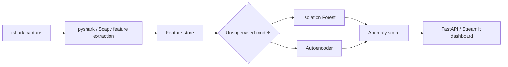

# covertlens

Cross-protocol covert channel detection via traffic side-channel statistics — no payload inspection, no signatures.

## Overview

Covert channels smuggle data through traffic that resembles legitimate protocol use. DNS tunneling can encode information in queries and responses, while ICMP tunneling can conceal it within diagnostic traffic. These techniques may evade controls that depend on known payload patterns or protocol-specific signatures.

covertlens studies detection through side-channel statistics: packet-size distributions, inter-arrival timing and regularity, and Shannon entropy of payload-byte distributions without decoding their contents. It fuses these features and applies unsupervised anomaly detection because representative, accurately labeled covert-channel datasets are scarce and often tied to particular tools or lab conditions.

## Current scope

The current phase targets DNS and ICMP traffic only. The architecture is intended to support later research on other protocols and observable channels, including TLS SNI, NTP, and HTTP/2 timing, but these are future work rather than current capabilities.

## Why this approach

- Signature-based intrusion detection systems rely on known indicators or protocol patterns; statistical anomaly detection can study behavior that changes across tunnel implementations.
- Size, timing, and entropy features remain measurable when content is encoded, obfuscated, or encrypted.
- Fusing multiple weak signals avoids relying on any single protocol field or heuristic.
- This work is distinct from the prior ThreatNet project: covertlens focuses on unsupervised, side-channel-based covert-channel detection rather than signature-based IDS detection.

## Related work

- Machine-learning methods for detecting DNS covert channels from query structure, traffic volume, entropy, and timing features.
- Support vector machine approaches to identifying anomalous ICMP payload and flow characteristics.
- Surveys and taxonomies of cross-protocol or protocol-agnostic covert timing channels.
- Unsupervised network anomaly detection under limited or unreliable labels.

**TODO: cite properly before publication.** Exact paper titles, authors, venues, and DOIs will be added after the literature review.

## Architecture

## Repository structure

- `data/` — ignored raw captures, processed feature data, and external baseline datasets; only directory markers are tracked.
- `src/` — the `covertlens` package, organized into capture, feature extraction, modeling, and dashboard components.
- `notebooks/` — exploratory analysis notebooks; generated notebook artifacts are not tracked.
- `tests/` — automated tests for the detection pipeline.
- `docs/` — project documentation and literature-review notes.
- `scripts/` — one-off repository setup and isolated-lab support scripts.

## Setup

**Coming in Phase 0.2.** Installation and environment instructions will be added after `requirements.txt` or `pyproject.toml` defines the project dependencies.

## Ethical use & research disclaimer

covertlens is intended solely for defensive security research. Any tunneling tools used for validation—including Iodine, dnscat2, ptunnel, and icmpsh—must be run only in isolated lab virtual machines that are never connected to production networks. This repository does not include or distribute tunnel-building or exploit code.

Users are responsible for complying with their institution's or organization's policies and all applicable local laws when capturing or analyzing network traffic. See [SECURITY.md](SECURITY.md) for further guidance.

## License

MIT License, see [LICENSE](LICENSE) file.

## Status / roadmap

- [ ] Phase 0 — Repository setup *(in progress)*
- [ ] Phase 1 — Data collection
- [ ] Phase 2 — Feature pipeline
- [ ] Phase 3 — Modeling
- [ ] Phase 4 — Dashboard
- [ ] Phase 5 — Adversarial hardening *(stretch)*
