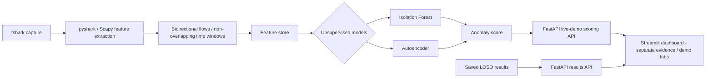

# covertlens

Cross-protocol covert channel detection via traffic side-channel statistics — no payload inspection, no signatures.

## Overview

Covert channels smuggle data through traffic that resembles legitimate protocol use. DNS tunneling can encode information in queries and responses, while ICMP tunneling can conceal it within diagnostic traffic. These techniques may evade controls that depend on known payload patterns or protocol-specific signatures.

covertlens studies detection through side-channel statistics: packet-size distributions, inter-arrival timing and regularity, Shannon entropy, payload compression ratios, and protocol-field anomaly statistics. Payload bytes are used for statistical measurements, not decoded for content matching or tunnel signatures. It fuses these features and applies unsupervised anomaly detection because representative, accurately labeled covert-channel datasets are scarce and often tied to particular tools or lab conditions.

## Current scope

The current phase targets DNS and ICMP traffic only. The architecture is intended to support later research on other protocols and observable channels, including TLS SNI, NTP, and HTTP/2 timing, but these are future work rather than current capabilities.

Repository setup, isolated-lab data collection, the feature pipeline, and initial modeling/evaluation are implemented (Phases 0–3). Phase 4 includes a FastAPI results/scoring backend and a two-tab Streamlit dashboard separating LOSO findings from the full-data live demo. Lab validation uses Iodine and dnscat2 for DNS, and ptunnel and Hans for ICMP; the attempted icmpsh/Wine path was abandoned.

## Why this approach

- Signature-based intrusion detection systems rely on known indicators or protocol patterns; statistical anomaly detection can study behavior that changes across tunnel implementations.
- Size, timing, and entropy features remain measurable when content is encoded, obfuscated, or encrypted.
- Fusing multiple weak signals avoids relying on any single protocol field or heuristic.
- This work is distinct from the prior ThreatNet project: covertlens focuses on unsupervised, side-channel-based covert-channel detection rather than signature-based IDS detection.

## Related work

- Machine-learning methods for detecting DNS covert channels from query structure, traffic volume, entropy, and timing features.
- Support vector machine approaches to identifying anomalous ICMP payload and flow characteristics.
- Surveys and taxonomies of cross-protocol or protocol-agnostic covert timing channels.
- Unsupervised network anomaly detection under limited or unreliable labels.

**TODO: cite properly before publication.** Exact paper titles, authors, venues, and DOIs will be added after the literature review.

## Architecture


```mermaid
flowchart LR
    A[tshark capture] --> B[pyshark / Scapy feature extraction]
    B --> W[Bidirectional flows / non-overlapping time windows]
    W --> C[Feature store]
    C --> D{Unsupervised models}
    D --> E[Isolation Forest]
    D --> F[Autoencoder]
    E --> G[Anomaly score]
    F --> G
    G --> H[FastAPI live-demo scoring API]
    R[Saved LOSO results] --> V[FastAPI results API]
    H --> K[Streamlit dashboard - separate evidence / demo tabs]
    V --> K
```

## Repository structure

- `data/` — ignored raw captures, processed feature data, and external baseline datasets; only directory markers are tracked.
- `src/` — the `covertlens` package, organized into capture, feature extraction, modeling, and dashboard components.
- `notebooks/` — exploratory analysis notebooks; generated notebook artifacts are not tracked.
- `tests/` — automated tests for the detection pipeline.
- `docs/` — [isolated-lab setup](docs/lab-setup.md), [Phase 0–3 findings and methodology notes](docs/notes.md), and literature-review notes.
- `scripts/` — one-off repository setup and isolated-lab support scripts.

## Setup instructions

### Environment setup

Use Python 3.11+ and install the package from the repository root:

```bash
python -m pip install -e .
```

For development tools, use `python -m pip install -e ".[dev]"`. The optional supervised XGBoost reference requires `python -m pip install -e ".[reference]"` (or `".[dev,reference]"` for both).

Install TShark separately at the OS level; pyshark is a wrapper and does not install it:

- **Windows:** install [Wireshark with its TShark component](https://www.wireshark.org/docs/wsug_html_chunked/ChBuildInstallWinInstall.html). Add the installation directory (typically `C:\Program Files\Wireshark`) to `PATH` if `tshark` is not found.
- **Linux:** install your distribution's TShark/Wireshark package through its package manager. Package names vary; see the [official installation guide](https://www.wireshark.org/docs/wsug_html_chunked/ChapterBuildInstall.html).
- **macOS:** install the official [Wireshark disk image](https://www.wireshark.org/download.html) and its command-line path support; see the [macOS installation guide](https://www.wireshark.org/docs/wsug_html_chunked/ChBuildInstallOSXInstall.html).

Open a fresh terminal and verify `tshark -v` succeeds before processing captures. See [requirements-lab.txt](requirements-lab.txt) for non-Python tools and [docs/lab-setup.md](docs/lab-setup.md) before any lab capture. Tunnel-tool installation and configuration remain manual; tunnel tools are not needed just to view existing results.

### Full pipeline from scratch

From the repository root, with authorized, correctly named lab captures in `data/raw/`, run in this order:

```bash
python -m covertlens.capture.manifest
python -m covertlens.features.build_dataset --window-seconds 30 --min-duration-to-split 60
python -m covertlens.models.run_loso_evaluation --protocol dns
python -m covertlens.models.run_loso_evaluation --protocol icmp
python -m covertlens.models.train_final
```

The manifest inventories the pcaps; `build_dataset` writes the flow/window features; LOSO evaluation writes the credible per-session results; `train_final` then saves the separate full-data demo models, scaler, feature order, and training-score thresholds. Run LOSO separately for both protocols so both dashboard selectors have results. LOSO requires at least two source sessions per protocol; substantially more independent sessions are needed for reliable findings. Final training requires flows for both protocols.

Optional diagnostics after feature extraction are `python scripts/inspect_features.py` and `python scripts/audit_dataset.py`; `python scripts/compare_baseline_sessions.py` compares DNS baseline sessions. Raw captures, manifests, features, generated evaluation results, and trained models stay local and gitignored. The repository does not ship the lab dataset or demo artifacts.

### Run the dashboard locally

After the pipeline completes, keep two terminals open at the repository root. Terminal 1 starts the FastAPI backend on localhost:

```bash
uvicorn covertlens.dashboard.api:app --reload --port 8000
```

Terminal 2 starts the Streamlit frontend (explicitly bound to localhost):

```bash
streamlit run src/covertlens/dashboard/app.py --server.address 127.0.0.1 --theme.base dashboard-theme.toml
```

Open `http://localhost:8501` in your browser. If the console commands are not on `PATH`, use `python -m uvicorn` and `python -m streamlit` respectively with the same arguments. `--reload` is for local development, not deployment.

`dashboard-theme.toml` supplies the restrained light research-workbench palette through Streamlit's native theme system. Omit the theme argument to use your preferred Streamlit theme; controls remain native and keyboard-accessible. The dashboard uses local system fonts, not external font or image services.

**Evidence distinction:** Evaluation Results presents the credible Phase 3 LOSO findings on held-out lab sessions, with the small session counts and limitations visible. Live Scoring Demo is illustrative only: its final models were trained on 100% of available flows with nothing held out. Its flags are not equivalent evaluation evidence or proof of a covert channel. See [docs/notes.md](docs/notes.md) for the LOSO methodology and limitations.

The dashboard uses `http://localhost:8000` by default; set `COVERTLENS_API_URL` before launching to change the backend address. Use only a trusted local/lab backend: uploads send capture bytes to that address. Evaluation Results shows per-session LOSO tables and grouped FPR/recall bars with session counts. Live Scoring Demo displays its full-data-model warning before the upload controls, text-labeled flags, and a per-flow score scatter chart. Uploads are scored automatically; successful results stay in that browser session to avoid duplicate scoring on widget reruns.

- `GET /` — health status and the live-demo warning.
- `GET /results/dns` or `/results/icmp` — latest saved LOSO run for that protocol, per-fold results, and separate FPR/recall summaries. Historical runs are not pooled; unavailable metrics are JSON `null`.
- `POST /score?protocol=dns` or `icmp` — upload a `.pcap`/`.pcapng` as multipart field `file` (maximum 50 MiB). Returns per-flow/window timestamps, packet counts, both anomaly scores, and `flagged_by_either` at the saved training-score 90th-percentile thresholds.

The scoring response carries `X-Covertlens-Evidence` and `X-Covertlens-Warning` headers: it is a **full-data live demo, not LOSO evidence**. Upload scores never recalibrate thresholds. Temporary capture files are removed after processing, including failures. This unauthenticated research API is for local/authorized lab use, not public deployment; load only trusted, locally generated model artifacts. Models and feature-name files are regeneratable and gitignored. Rerun `train_final` if older artifacts lack saved thresholds.

### Evaluation and initial findings

The primary evaluation is leave-one-session-out (LOSO), grouped by the original `source_file`, with scaling fitted on each training fold only. Non-overlapping windows from the same capture stay together to avoid session leakage. `run_comparison.py` remains an exploratory random-row quick check, not the evaluation used for research claims.

Isolation Forest and the Autoencoder train on the full unlabeled training fold, assuming it is sufficiently representative of normal traffic; they do not filter training rows by ground-truth labels. Their thresholds use the training-score 90th percentile by default. XGBoost uses training labels and a fixed 0.5 probability threshold: it is a supervised reference, not a like-for-like comparison or a guaranteed performance upper bound.

The current local dataset contains 12 capture runs and 965 flow/window samples: DNS has 568 legitimate and 269 covert samples; ICMP has 80 legitimate and 48 covert samples. Each protocol has four baseline sessions and two covert sessions. Windows remain correlated within sessions, and shared lab conditions limit independence across runs.

On the single held-out Iodine session, recall was 76.8% for Isolation Forest, 84.2% for the Autoencoder, and 30.5% for XGBoost. This is a preliminary result at different operating thresholds, not evidence of general superiority. With single-class held-out sessions, ROC-AUC is undefined and average precision cannot assess class discrimination; evaluation reports false-positive rate on legitimate sessions and recall on covert sessions separately.

Feature direction also depends on protocol: observed DNS covert traffic had lower packet-size variation than its baseline, while ICMP covert traffic had higher variation. Entropy is not a direct measure of unpredictability and was higher on average for legitimate ICMP in this dataset. See [the findings and methodology notes](docs/notes.md) for the detailed observations, diagnostic results, and limitations. More independent captures and tool diversity are needed before broad generalization claims.

## Ethical use & research disclaimer

covertlens is intended solely for defensive security research. Any tunneling tools used for validation—including Iodine, dnscat2, ptunnel, Hans, or icmpsh—must be run only in isolated lab virtual machines that are never connected to production networks. This repository does not include or distribute tunnel-building or exploit code.

Users are responsible for complying with their institution's or organization's policies and all applicable local laws when capturing or analyzing network traffic. See [SECURITY.md](SECURITY.md) for further guidance.

## License

MIT License, see [LICENSE](LICENSE) file.

## Status / roadmap

- [x] Phase 0 — Repository setup
- [x] Phase 1 — Initial isolated-lab data collection
- [x] Phase 2 — Feature pipeline with long-flow windowing
- [x] Phase 3 — Initial modeling and session-grouped evaluation
- [ ] Additional independent capture sessions and broader validation
- [x] Phase 4 — Initial local results dashboard and live-scoring demo
- [ ] Phase 5 — Adversarial hardening *(stretch)*
